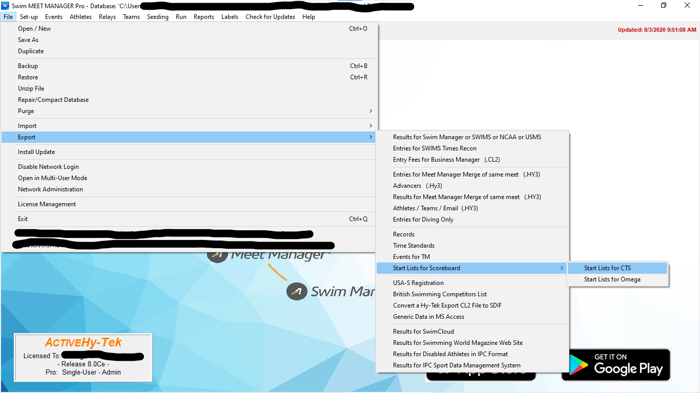
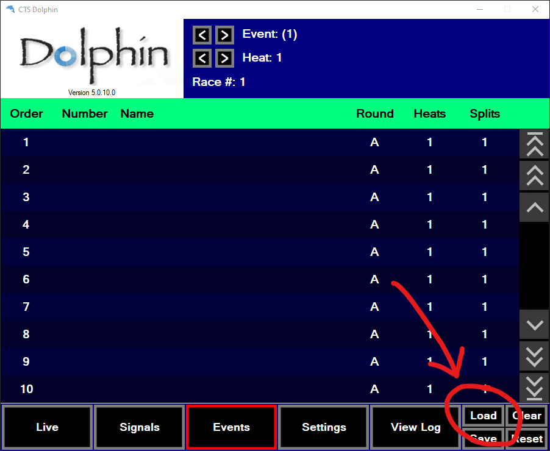
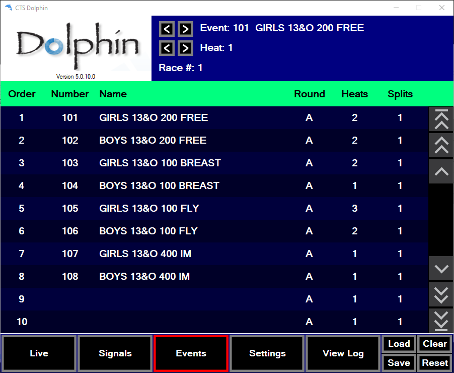

# Export Meet Manager events to Dolphin

This program converts a list of swimming events from Hy-Tek Meet Manager into
a format that can be imported by CTS Dolphin software.

## :sparkles: Installation :sparkles:

Download the [latest release of
`events2dolphin.exe`](https://github.com/JohnStrunk/events2dolphin/releases)

## :book: Instructions :book:

1) Export a start list for CTS scoreboards.
   - In Hy-Tek Meet Manager, go to:  
     File > Export > Start Lists for Scoreboard > Start Lists for CTS
   - Choose an output folder and the desired session.
   - This will write a set of `*.scb` files to the chosen directory, one per
     event in the session.  
     *Note: You can export multiple sessions then convert and import them all
     at once.*  
     
1) Use `events2dolphin.exe` to generate the Dolphin event CSV.
   - Open the folder from above and select all the `*.scb` files.
   - Drag the files (all at once) onto this executable.
   - This program will write a file: `dolphin_events_X-Y.csv`, where `X` and
     `Y` are the first and last event numbers.
1) Load the CSV into the Dolphin software.
   - In the Dolphin software, go to the Events screen.
   - Click Load, and select the CSV from above  
   
   - The events should appear in the table, with the name, number, and number
     of heats.  
   

## :wrench: Troubleshooting :wrench:

Having a problem??? [Open an
issue](https://github.com/JohnStrunk/events2dolphin/issues/new)

------

## Changelog

This changelog is based on [Keep a
Changelog](https://keepachangelog.com/en/1.0.0/)

This project follows [Semantic Versioning](https://semver.org/)

## [Unreleased]

## [0.5.1] - 2021-07-05

### Fixed

- Tolerate cp1252 encoded files

## [0.5.0] - 2020-08-16

### Added

- Initial version

[unreleased]: https://github.com/JohnStrunk/events2dolphin/compare/v0.5.1...HEAD
[0.5.1]: https://github.com/JohnStrunk/events2dolphin/compare/v0.5.0...v0.5.1
[0.5.0]: https://github.com/JohnStrunk/events2dolphin/releases/tag/v0.5.0